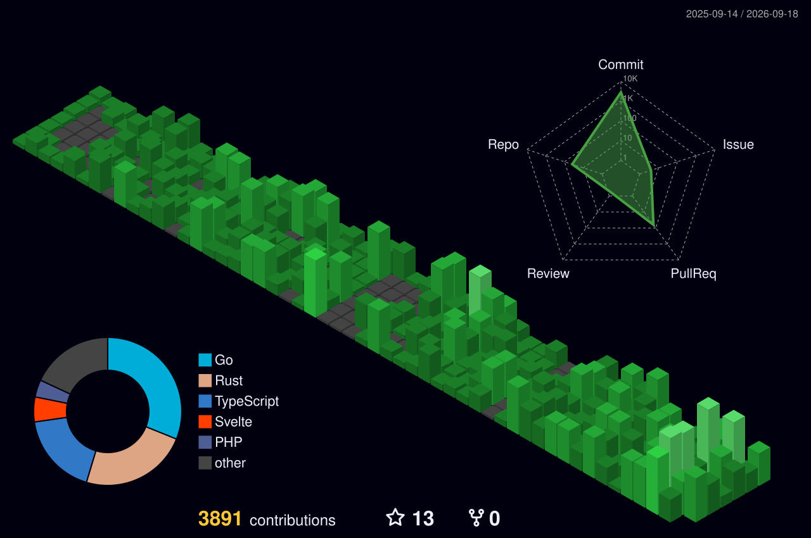

 

## About Me

- <strong>Name</strong>: lazzerex

- <strong>Hobbies</strong>: Music

- <strong>Favourite Artists</strong>: Sakurazaka46, Official HIGE Dandism, Sakanaction, Yorushika, Haruka Nakamura, Porter Robinson
  
- <strong>Interests</strong>: Open Source Software, Operating Systems

- <strong>Currently Building</strong>: Backend and systems projects with Go, Rust, and TypeScript, with a growing focus on networking, storage, observability, and distributed systems

- <strong>Anime & Manga</strong>: Serial Experiments Lain, Chi: Chikyū no Undō ni Tsuite, Boku dake ga Inai Machi, Vagabond, Totsukuni no Shōjo
 

>**_最高の日々は終わった?
幸せな日々は消えた?
輝いた瞬間は遠く
過去に 戻れやしないと知っている
夢を見るなら 先の未来がいい_**
>
>_Are the best days over? Have the happy days disappeared? The shining moments are far away. I know I can't go back to the past. If I'm going to dream, it's better to dream about the future._  - 櫻坂46「何歳の頃に戻りたいのか？」

 

  

  

## Tech Stack

### Languages

### Frameworks & Platforms

### Backend & APIs

### Databases & Storage

### Systems & Infrastructure

### Development Tools

# GitRPG

  

# GitFut

  

#  Contribution 

 

# Quotes

 

  
  

# Languages

  
 

 

# Stats 

 

  

  

# GitRoll

 

<!--    

  

 -->

#  My Personal Website 
> ### Where you can learn more about me and my coding journey.

# My Personal Blog
> ### Where I write about the latest trends in technology and diving deep into scientific discoveries, while also jamming through the worlds of music and gaming.

# Lazzerex Digital Labs
> ### Where you can find all the games and some side projects that I've made.

